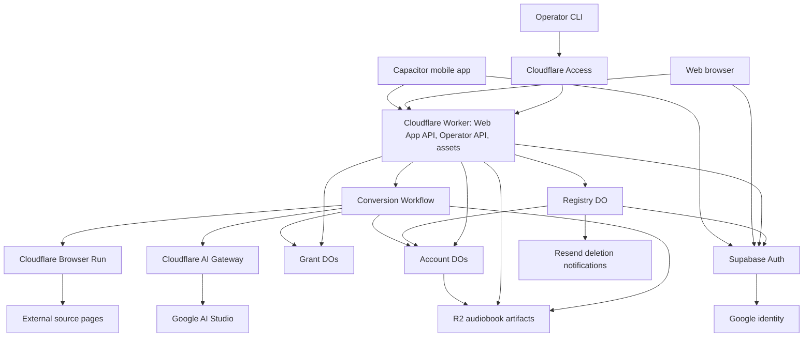
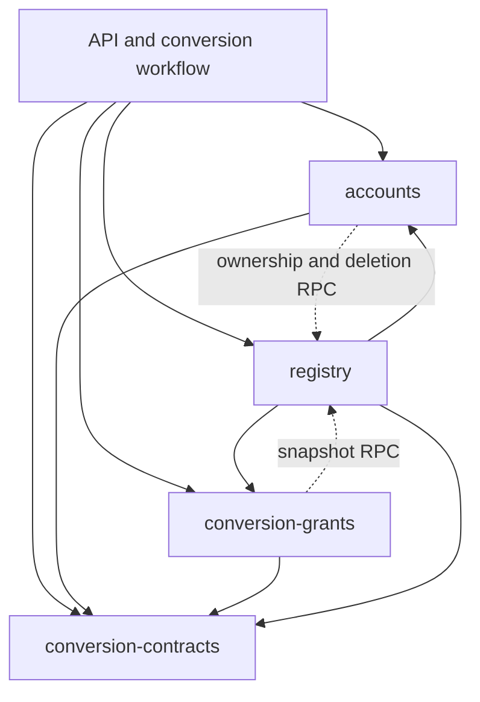

# System overview

Cup turns source content behind a URL into an audiobook. A shared web application runs in a browser and in Capacitor mobile shells. A Cloudflare Worker serves the web assets and APIs, while Cloudflare Workflows coordinates conversion and SQLite Durable Objects own mutable application state.

## Runtime map

The Worker is the HTTP boundary. The workflow performs long-running conversion work; account and trial objects control ownership, allowance, and lifecycle. The shared registry also coordinates cleanup across R2 and Supabase and sends lifecycle notifications. The diagram groups resources by responsibility; a Durable Object class creates multiple isolated objects where required.

## Responsibilities and code boundaries

| Component                                 | Responsibility                                                                                 | Implementation                                                                                                                      |
| ----------------------------------------- | ---------------------------------------------------------------------------------------------- | ----------------------------------------------------------------------------------------------------------------------------------- |
| Web application                           | Conversion entry, account UI, playback, and session management                                 | [Web source](../../apps/web-app/)                                                                                                   |
| Native shells                             | Package the shared UI and supply platform sign-in, sharing, links, and media integration       | [Mobile guide](../../apps/mobile-app/README.md), [platform adapters source](../../apps/web-app/src/platform/)                       |
| Operator CLI                              | Administrative requests authenticated through Cloudflare Access                                | [Operator guide](../../apps/operator/README.md)                                                                                     |
| Worker and API server                     | Assets, domain routing, authentication, request validation, conversion admission, and delivery | [Worker entry source](../../apps/cloudflare-worker/src/index.ts), [API composition source](../../libs/api-server/src/api-server.ts) |
| Conversion Workflow                       | Durable conversion steps and terminal outcomes                                                 | [Workflow source](../../libs/create-audiobook-from-url-workflow/)                                                                   |
| Account and trial state                   | Ownership, history, duration accounting, lifecycle, and routing to the owning object           | [Storage ownership](#storage-ownership)                                                                                             |
| Source preparation                        | Render source pages and prepare audiobook source material                                      | [Preparation library](../../libs/prepare-source-material/)                                                                          |
| Narration selection and document creation | Select source material and structure narration text and synchronization units                  | [Selection library](../../libs/narration-content-selection/), [document creation library](../../libs/narration-document-creation/)  |
| Audiobook production                      | Synthesize segments, assemble audio, store the canonical audiobook, and generate exports       | [Audiobook production library](../../libs/audiobook-production/)                                                                    |

The libraries are code boundaries inside the deployed system, not separate network services. [Accounts](../../libs/accounts/README.md) owns account conversion state, duration accounting, lifecycle transitions, and artifact fencing. [Conversion grants](../../libs/conversion-grants/README.md) owns trial grants. [Registry](../../libs/registry/README.md) owns account identity mapping and provisioning, grant inventory, conversion ownership for both accounts and trials, ingress limits, and account deletion coordination. Owner objects consume narrow registry RPC interfaces; integration tests in the registry library exercise the three objects together. [Conversion contracts](../../libs/conversion-contracts/README.md) owns runtime-independent shared schemas, types, and duration calculations.

## API definitions

The [application contracts](../../libs/web-app-api.routes/src/hono-app.ts) and [operator contracts](../../libs/operator-api.routes/src/hono-app.ts) define HTTP methods, paths, and schemas; [server composition](../../libs/api-server/src/api-server.ts) mounts their handlers. Account deletion and recovery handlers are implemented directly in the server composition. The [OpenAPI export](../../libs/web-app-api.client/scripts/export-openapi-json.ts) covers the application contracts, not the operator API. See [authentication and authorization](authentication.md) for access rules. Durable Object RPC and Workflow invocation are internal platform interfaces.

## Storage ownership

Each Durable Object has its own SQLite database; account and grant objects isolate state by owner. See the [database schema diagrams](durable-object-storage.md) for tables, columns, keys, and declared relationships in all three stores. Drizzle schemas define the tables, constraints, and indexes for all three stores, and application queries use the Drizzle Durable Object driver. Each object applies its generated migrations before accepting work; database changes follow the [account migration guide](../../libs/accounts/README.md#database-migrations), the [grant migration guide](../../libs/conversion-grants/README.md), or the [registry migration guide](../../libs/registry/README.md). `RegistryDurableObject` reuses the deployed grant registry namespace through a Cloudflare class rename; the account registry was never deployed. The existing singleton name remains `registry`.

The one-time transition from handwritten trial schemas preserves grant identities, credentials, settings, and registry inventory while discarding old conversions and restoring full configured allowances. Old audiobook ownership routes are removed, so those links stop resolving; R2 artifacts are retained separately. New conversions survive subsequent migration replays. [ADR 0004](../adr/0004-preserve-only-grants-during-drizzle-transition.md) defines this exception to historical retention.

| Store                   | Ownership and purpose                                                                                                 | Primary source                                                                      |
| ----------------------- | --------------------------------------------------------------------------------------------------------------------- | ----------------------------------------------------------------------------------- |
| Account object          | One per account; private conversion history, duration ledger, and lifecycle state                                     | [Account object](../../libs/accounts/src/account-durable-object.ts)                 |
| Conversion grant object | One per trial grant; shared allowance, credentials, sessions, and conversions                                         | [Grant object](../../libs/conversion-grants/src/conversion-grant-durable-object.ts) |
| Registry                | Singleton identity-to-account mapping, grant inventory, conversion ownership, provisioning, and deletion coordination | [Registry](../../libs/registry/src/registry-durable-object.ts)                      |
| Supabase Auth           | Identity-provider data; Cup application state remains in Durable Objects                                              | [Auth configuration](../../supabase/config.toml)                                    |
| R2 audiobook bucket     | Conversion artifacts: audio segments, assembled audio, canonical manifests, and cached exports                        | [Artifact storage](../../libs/audiobook-production/src/audio-segment-storage.ts)    |

Cloudflare Workflows owns execution state; the account or grant object owns the application-visible conversion outcome. See [conversion](conversion.md) for artifact production and delivery, and [account deletion](account-deletion.md) for cleanup and write fencing. Infrastructure state is covered by the [Terraform guide](../../terraform/README.md).

## External services

- Cloudflare Access: protects operator requests
- Cloudflare Browser Run: visits external source pages
- Cloudflare AI Gateway: routes provider requests and records request metadata
- Google AI Studio: narration services (TTS provider)
- Supabase Auth: IAM (Cup owns account authorization and application data)
- Google Auth Platform: social sign-in
- Resend: account-deletion emails

## Development and test view

Local web development uses Wrangler and can use a local Supabase stack through `pnpm auth:local`. Native Android uses the production API origin; starting local Supabase does not redirect the native app. See [signup operations](../social-signup-operations.md) for environment setup.

Tests use [account test bindings](../../libs/accounts/wrangler.test.jsonc), [grant test bindings](../../libs/conversion-grants/wrangler.test.jsonc), [application E2E bindings](../../qa/e2e/wrangler.jsonc), and [source-page fixtures](../../libs/prepare-source-material/test-e2e/fixtures/README.md). Browser tests run through Docker. Fixtures and local-development authentication paths are test infrastructure, not production identity providers. The [validation guide](../../AGENTS.md#validation) distinguishes free checks from paid narration evals.
