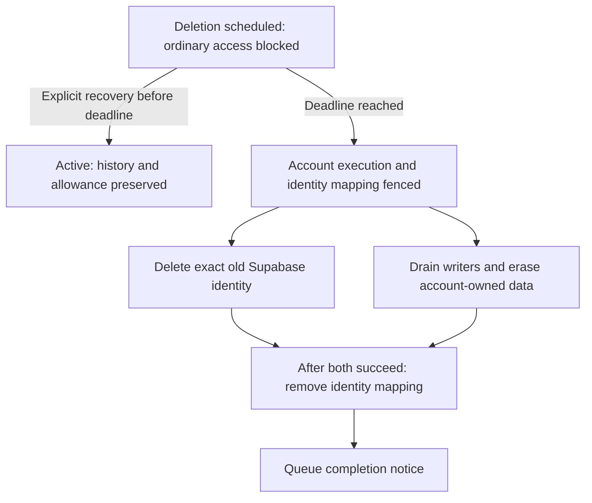

# Account deletion and recovery

[Account deletion](../CONTEXT.md#account-deletion) is the full lifecycle spanning account state, conversion execution, object storage, Supabase identity, and notifications. [Account erasure](../CONTEXT.md#account-erasure) is its internal step for removing Cup-owned content and records. User-facing copy uses account deletion. Scheduling blocks ordinary access immediately and allows explicitly confirmed recovery for seven days. The registry coordinates durable cleanup independently of the account being erased.

Identity deletion and Cup storage cleanup retry independently; an identity-provider outage does not prevent Cup cleanup. The diagram shows dependencies, not a distributed transaction.

## Confirmation and recovery

Deletion and recovery require a one-use challenge and fresh Google authentication for the same identity, as described in [authentication](authentication.md#operator-access-and-lifecycle-confirmation). Signing in alone does not restore access.

Lifecycle endpoints use the shared application API contracts, request validation, and error envelope. Account transitions return explicit confirmation conflicts across Durable Object RPC; unexpected storage or registry failures remain operational errors. After scheduling, the API attempts Google token revocation when the client supplies a provider token, verifies that it belongs to the same identity, and records the outcome. Revocation failure does not undo scheduling; a failure to record the outcome is reported as an operational error, not a rejected confirmation.

Scheduling stops playback on the requesting client and blocks subsequent private access checks. Lifecycle inspection and explicit recovery remain available until the deadline. Recovery preserves history and allowance; once the deadline is reached, recovery is refused.

Sources: [client confirmation](../../apps/web-app/src/data-fetching/account-confirmation.ts), [lifecycle API](../../libs/api-server/src/api-server.ts), and [atomic account transitions](../../libs/accounts/src/account-lifecycle.ts).

## Fencing and cleanup

The account persists lifecycle changes and delivery intent together, then delivers that intent to the registry through a replayable outbox. At cleanup, changing the execution epoch prevents old workflow activity from writing. Registered artifact writers must drain and uncertain storage effects must be reconciled before erasure; a lost acknowledgement does not prove a writer stopped.

Account erasure removes the account's R2 prefix, conversion-owner routes, and account records, retaining a constant erasure marker to reject late execution. The registry deletes the exact old Supabase identity and removes its mapping only after both identity and account cleanup succeed. Original trial conversions and other accounts remain separate.

Failures retain durable progress and retry with backoff. Operators can inspect overdue cleanup through [signup operations](../social-signup-operations.md); there is no force-complete action that discards uncertain writers.

Sources: [account cleanup](../../libs/accounts/src/account-durable-object.ts), [writer reconciliation](../../libs/accounts/src/account-artifact-writers.ts), [registry alarms](../../libs/registry/src/registry-durable-object.ts), and [coordinator](../../libs/registry/src/deletion-coordinator.ts).

## Notifications and retained evidence

Scheduled and completed notices have durable intent and distinct immutable idempotency keys. Retries stop before the provider deduplication window expires to avoid duplicate sends after ambiguous outcomes. Provider acceptance does not establish inbox delivery.

Terminal notification payloads are redacted. After cleanup and notification processing finish, receipts retain identifiers, timestamps, and outcomes for 90 days, excluding email, tokens, and provider response bodies. The account's erasure marker carries no deletion-attempt identifier. These application rules do not establish retention in external provider logs or backups.

Source: [notification and receipt implementation](../../libs/registry/src/deletion-coordinator.ts), including retry timing. See [signup operations](../social-signup-operations.md) for configuration and inspection.

Related research: [provider deletion](../research/social-signup/account-deletion-research.md), [transactional email](../research/social-signup/transactional-email-research.md), and [telemetry retention](../research/social-signup/telemetry-retention-research.md).
