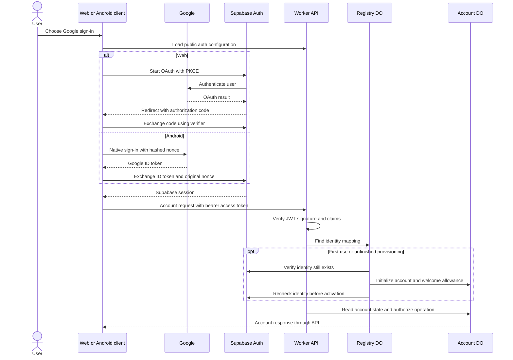
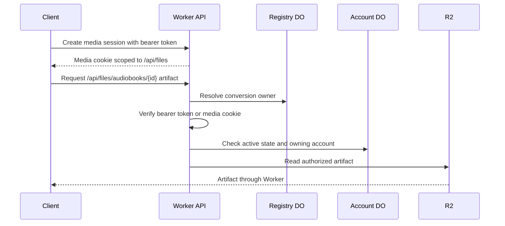

# Authentication and authorization

Supabase establishes identity; Cup decides whether that identity may access a particular account or conversion. A valid access token does not override an account's deletion state or establish ownership of an audiobook.

## Sign-in and account provisioning

On the web, the Supabase SDK persists the session and PKCE verifier in browser local storage and handles the OAuth return. Android uses native Google sign-in, exchanges its ID token with Supabase, and persists the Supabase session in secure storage. Android's Google request carries a hashed nonce while the exchange supplies the original nonce. Dedicated iOS account support is deferred; its adapter reuses web behavior and is not evidence of a validated native login flow.

The API verifies Supabase JWTs locally against the issuer's signing keys and validates audience, role, subject, and time claims. The HTTP authentication adapter verifies the token and supplies dependencies to the [account authentication use case](../../libs/api-server/src/use-cases/authenticate-account.ts), which resolves account ownership, provisions first-use identities, and resumes unfinished provisioning. First use provisions a separate Cup account ID through the registry. Provisioning is persisted and retried, and checks the provider identity before activation; ingress limits constrain new account creation. The account initializes its welcome duration allowance once. Subsequent operations consult Cup lifecycle state in addition to token validity.

Sources: [session lifecycle](../../apps/web-app/src/data-fetching/account-session.ts), [web adapter](../../apps/web-app/src/platform/account-auth.web.ts), [Android adapter](../../apps/web-app/src/platform/account-auth.android.ts), [iOS adapter](../../apps/web-app/src/platform/account-auth.ios.ts), [token verification](../../libs/api-server/src/account-auth.ts), and [registry provisioning](../../libs/registry/src/registry-durable-object.ts).

## Private media access

Browser audio elements need an authorization path beyond ordinary JSON requests. The client obtains a media session using its bearer token. The Worker issues an HTTP-only, same-site cookie scoped to `/api/files` for audio segment delivery and bounded by the token's expiry. Android also installs the session through its [native media bridge](../../apps/mobile-app/android/app/src/main/java/com/cup_audio/app/AccountMediaPlugin.java).

Audiobook JSON lives at `/api/audiobooks/{conversionId}` and requires bearer identity for private audiobooks. Individual MP3 segments live under `/api/files/audiobooks/{conversionId}/segments/{sequence}/audio.mp3` and accept bearer identity or the cookie fallback. There are no assembled-track, captions-file, or EPUB routes. Native players send the bearer token directly. Media-session creation at `/api/files/session` and account API operations require bearer identity. Private delivery checks the conversion's owner and current account state on requests. Scheduling deletion therefore blocks subsequent private requests even while a previously issued JWT remains unexpired. This is not a promise to retract bytes already downloaded by another client.

The client refreshes media authorization and pauses playback when authorization fails. Sign-out clears local identity and cached account data, stops and unloads media, and waits for outstanding cookie issuance before clearing media sessions so a late response cannot silently reestablish playback. Local sign-out is not an immediate global revocation mechanism for every existing JWT.

Sources: [media cookie and token handling](../../libs/api-server/src/account-auth.ts), [ownership middleware](../../libs/api-server/src/api-server.ts), [delivery](../../libs/api-server/src/serve-audiobook.ts), and [client session transitions](../../apps/web-app/src/data-fetching/account-session.ts).

## Trial access

A trial link carries a grant credential that is exchanged for a grant session. That session authorizes inspecting the grant and starting conversions while the grant permits it; it does not establish a personal account or authorize listing all grant conversions. Reading prepared trial text, polling segment state, and replaying completed audio require a valid session for the owning grant. The Worker checks the authoritative grant state before loading artifacts on every audiobook and media request, including HEAD, range, and conditional requests. Expired or revoked grants deny access; exhausted or fully reserved allowances still permit reading and replay. An article link alone, another grant’s session, or account sign-in alone does not authorize access. Generating new audio or retrying preparation requires a session for the owning grant. Preparation can proceed with exhausted duration; synthesis requires a reservation. Trial media uses the HTTP-only grant cookie scoped to `/api`; browser audio requests send credentials, and native players forward the grant cookie. Credentialed CORS permits the configured application origins; arbitrary origins receive no CORS permission. Responses use `private, no-store`. Expiry and revocation block subsequent requests but cannot retract already downloaded text or audio. [ADR 0007](../adr/0007-require-active-grant-access-for-trial-audiobooks.md) records this access policy.

Listening positions belong to the signed-in listener, including positions on trial articles authorized by their owning grant. Anonymous listeners keep positions locally on their browser or native device. Account history contains conversions started by that account, and the client clears its remembered trial when switching into an account.

Sources: [grant-session handlers](../../libs/api-server/src/api-server.ts), [grant object](../../libs/conversion-grants/src/conversion-grant-durable-object.ts), and [client trial-link flow](../../apps/web-app/src/data-fetching/trial-link.ts).

## Operator access and lifecycle confirmation

The operator CLI authenticates through Cloudflare Access. The Worker validates the Access assertion against its configured issuer, audience, and operator identity before admitting operator routes. Development token handling is restricted to trusted development URLs. Operator authentication is separate from customer Google/Supabase sign-in.

Deletion and recovery require an additional one-use challenge and Google authentication after that challenge was issued. They also enforce request origin and content-type constraints. See [account deletion](account-deletion.md) for why ordinary sign-in does not restore access.

Sources: [operator guide](../../apps/operator/README.md), [Access verification and routing](../../libs/api-server/src/api-server.ts), [development access](../../libs/api-server/src/operator-access.ts), and [lifecycle handlers](../../libs/api-server/src/api-server.ts). Provider configuration and outstanding rollout verification belong in [signup operations](../social-signup-operations.md) and the [Terraform guide](../../terraform/README.md).

## Historical evidence and deferred work

The [auth service comparison](../research/social-signup/auth-saas-research.md) and [native sign-in investigation](../research/social-signup/native-social-sso-research.md) preserve the provider evaluation. The [session-revocation investigation](../research/social-signup/supabase-session-revocation-research.md) describes an online validation alternative; this checkout uses local JWT verification instead. The [Apple/iOS handoff](../research/social-signup/deferred-apple-ios.md) records deferred integration questions, not a validated flow or launch commitment.
