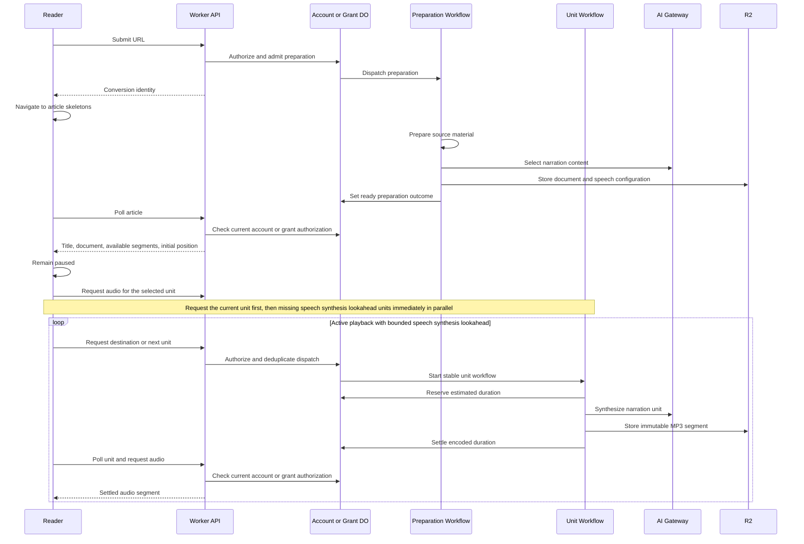

# Conversion from source URL to audiobook

The API admits preparation, an account or trial grant owns allowance and outcomes, and Cloudflare Workflows runs durable processing steps. R2 stores the prepared narration document and independently generated audio segments. [ADR 0005](../adr/0005-prepare-narration-before-player-controlled-synthesis.md) records the player-controlled flow; [domain context](../CONTEXT.md) defines the representations.

Two typed workflow entry points run in the same Worker and library: [PrepareAudiobookWorkflow](../../libs/create-audiobook-from-url-workflow/src/prepare-audiobook-workflow.ts) prepares the document, and [SynthesizeAudioSegmentWorkflow](../../libs/create-audiobook-from-url-workflow/src/synthesize-audio-segment-workflow.ts) generates one segment. Their bindings are `PREPARE_AUDIOBOOK_WORKFLOW` and `SYNTHESIZE_AUDIO_SEGMENT_WORKFLOW`. Preparation dispatch, recovery, and retries use the first; segment dispatch, polling, and retries use the second. Preparation uses the workflow name `prepare-audiobook` and uses the conversion ID as its instance ID. Synthesis uses the separate workflow name `synthesize-audio-segment` and instance IDs `segment-{conversionId}-{sequence}`. Existing preparation and segment runs in the former combined workflow `create-audiobook-from-url` are not moved into the new workflows; settled audio remains reusable through the owner's ledger and stored artifacts.

Both runners resolve a [conversion execution adapter](../../libs/create-audiobook-from-url-workflow/src/conversion-execution.ts) that captures the conversion owner, conversion ID, and execution epoch. It supplies the artifact prefix and bucket, records preparation phases and outcomes, and reserves, settles, or releases segment duration. The account adapter applies execution fencing and the protected artifact writer; the grant adapter retains grant phase tracking, outcome details, and duration rules. Resolution does not cache lifecycle authorization or replace checks in the owning Durable Object. Workflow step names, retry policies, and payload formats remain the runners' responsibility.

## Preparation

After the server accepts the request and returns a conversion ID, the app navigates to the article view. The reader shows title and paragraph skeletons until preparation finishes; Play remains disabled. Preparation uses [source material](../../libs/prepare-source-material/), [narration selection](../../libs/narration-content-selection/), and [document creation](../../libs/narration-document-creation/). It stores the title, safe structured HTML, synchronization units, source URL, and speech configuration, then finishes without requesting speech or reserving duration. The conversion status `ready` means preparation is complete, including when no audio exists.

Active accounts and open, unexpired trial grants may prepare articles without available duration. Existing per-owner admission limits still apply. If preparation fails, the article view shows an error and a Retry button. Retry restarts preparation for the same conversion. Speech configuration is stored with the document so later generation and retries use the same choice (model, voice, ...).

Preparation outcomes record narration text size, chunk count, and content-selection provider usage. Generated audio duration is recorded separately per segment by the owner's duration accounting; preparation outcomes do not contain audio duration or speech-provider usage totals.

## Progressive generation and accounting

Each synchronization unit maps to one narration chunk and one independently playable MP3 segment. Once prepared text loads, the player requests audio for the selected unit even while paused, including a unit restored from the saved listening position. It keeps playback paused and does not request units ahead until Play. The player targets a speech synthesis lookahead of roughly 60 seconds of estimated audio, using whole units. On Play, it requests the current unit first, then immediately requests missing units within the speech synthesis lookahead in parallel while the current unit is still generating. In-flight requests are reused when speech synthesis lookahead is recalculated. A failed unit blocks new requests beyond it until explicit retry or seeking past it; requests already in flight can finish. Seeking while playing starts at the destination and requests speech synthesis lookahead from there; seeking while paused requests only the destination unit without starting playback. Pause stops synthesis ahead; selecting a unit while paused still requests its audio. Closing the player stops new scheduling while requested workflows finish normally. Players keep independent playback positions and speech synthesis lookahead. Signed-in users share a saved listening position across devices, restored only when a player initially loads the article. Completed audio is shared across players.

The owner serializes dispatch using one stable workflow identity per conversion and sequence. Concurrent requests join that workflow. Explicit retry restarts a failed instance; stored immutable audio is reused if a previous attempt already published it. Before calling the provider, the owner reserves the full estimated duration. Settlement uses actual encoded duration and records each segment once. Failed attempts release only the failed unit's reservation; completed audio remains stored and charged, with playback subject to current account or grant authorization. [ADR 0003](../adr/0003-charge-for-accessible-generated-narration.md) defines capped overruns and free reuse; [ADR 0007](../adr/0007-require-active-grant-access-for-trial-audiobooks.md) defines current trial access after expiry and revocation.

The API derives each unit’s playback state from settled duration, workflow progress, and stored failure details in the [segment-state use case](../../libs/api-server/src/use-cases/get-audio-segment-state.ts), with Cloudflare dependencies wired by its [environment adapter](../../libs/api-server/src/audio-segment-state.ts). Unit workflows retry transient provider errors automatically. Exhausted retries stop playback at that unit and offer Retry; listeners may explicitly seek past it. Allowance errors preserve the prepared document and completed audio. All-unit audio availability does not assemble a full track. EPUB exports and full-track downloads have been removed.

Sources: [preparation runner](../../libs/create-audiobook-from-url-workflow/src/run-prepare-audiobook-workflow.ts), [unit runner](../../libs/create-audiobook-from-url-workflow/src/run-audio-segment-workflow.ts), [account ledger](../../libs/accounts/src/account-duration-ledger.ts), [grant ownership](../../libs/conversion-grants/src/conversion-grant-durable-object.ts), and [segment reuse](../../libs/audiobook-production/src/produce-audio-segment.ts).

## Delivery, positions, and lifecycle

The reader receives prepared text independently of unit status. Only settled segments are delivered, with range, HEAD, and ETag support. Trial reading, segment polling, replay, and new synthesis require the owning grant session, and expiry or revocation blocks subsequent audiobook and media requests. Exhausted duration does not block reading or replay. Private articles require an active owning account. [Authentication](authentication.md) describes bearer and media-cookie authorization.

Each signed-in listener has one saved position per conversion: synchronization unit ID and offset within that unit's audio. The server replaces it on every save. Initial player load restores it and remains paused; subsequent query refreshes and other devices' saves never move a loaded player. Local writes are serialized to retain their order. Anonymous positions are stored on the browser or native device. Positions are saved periodically and on pause or seek, so device switches resume from the last successful write.

The API resolves [conversion readers](../../libs/api-server/src/conversion-reader.ts) for conversion state, ready manifests, and settled segments, and [conversion dispatch adapters](../../libs/api-server/src/conversion-dispatch.ts) for preparation retries and synthesis requests. These interfaces bind operations to the owning conversion; request authentication and operation-specific authorization remain in the HTTP handlers and middleware. Account manifest reads retain active-state and artifact-prefix checks, and account synthesis dispatch obtains the current execution epoch. The signed-in listener is resolved separately because an account can hold a listening position for a grant-owned conversion.

Browser playback uses an audio element and Media Session actions. Native Android and iOS playback coordinators own passage selection and speech synthesis lookahead while their WebViews are suspended. They delegate authenticated requests and polling to API clients, serialized listening positions to position stores, and playback, media controls, and background resources to platform audio adapters. Capacitor bridges translate commands and state; the Android service hosts the components for its lifetime. See [native playback components](../../apps/mobile-app/README.md#progressive-playback). Android uses a media playback foreground service; iOS uses a playback audio session and background audio mode. Both stop scheduling on pause, interruptions, or player closure. Operating systems may suspend browsers, and native device lock-screen continuity still needs physical-device verification; native builds alone do not verify it. A native authorization expiry stops new requests with an error and requires renewed authorization before retry.

Ownership parameters and account execution epochs fence unit generation and artifact writes. The shared [artifact prefix](../../libs/conversion-contracts/src/artifact-prefix.ts) covers preparation, audio, delivery, and deletion. Account lifecycle state is checked on new private requests; deletion fences late writes. Retries do not make provider requests, R2 publication, owner settlement, and workflow dispatch atomic. See [account deletion](account-deletion.md) for cleanup responsibilities. A separate explicit generation-cancellation control remains deferred.
