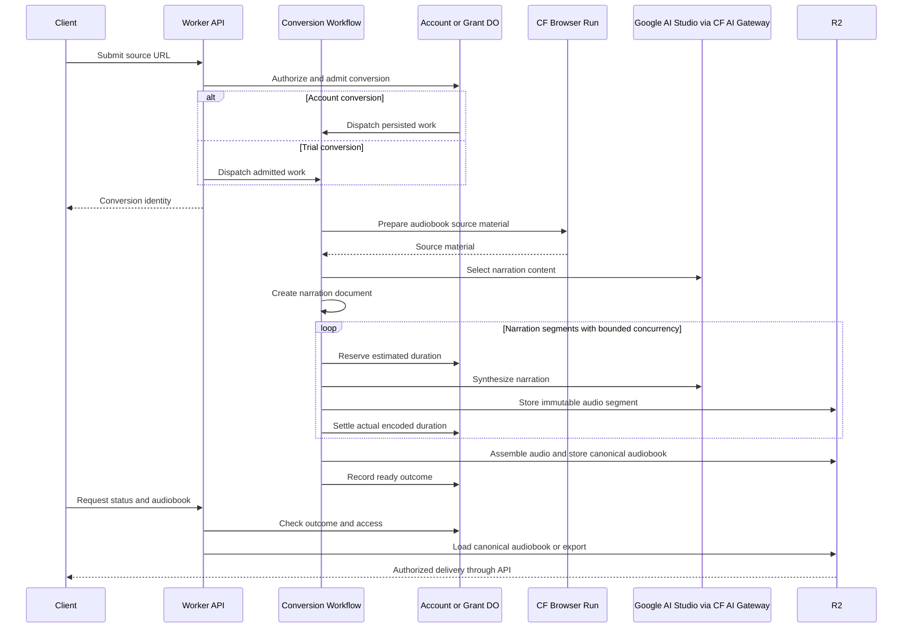

# Conversion from source URL to audiobook

Conversion crosses three ownership boundaries: the API admits work, an account or grant owns its allowance and outcome, and Cloudflare Workflows runs durable processing steps. R2 holds the resulting artifacts. The [domain context](../CONTEXT.md) defines the intermediate representations.

The diagram shows the logical sequence; account and trial admission have separate implementations, and segment work runs concurrently. The [workflow runner](../../libs/create-audiobook-from-url-workflow/src/run-create-audiobook-from-url-workflow.ts) is authoritative for step boundaries, concurrency, timeouts, retry policies, and content limits.

## Preparation and narration

[Source preparation](../../libs/prepare-source-material/) renders external pages through Browser Run, including JavaScript-dependent content. [Narration selection](../../libs/narration-content-selection/) chooses the material to narrate. [Document creation](../../libs/narration-document-creation/) turns the selection into structured narration text and synchronization units. [Production](../../libs/audiobook-production/) synthesizes and encodes audio segments and assembles the canonical audiobook.

The workflow persists its speech configuration choice and can retain a previous choice when resuming already-started conversions. Provider retries therefore do not intentionally mix a newly configured provider into existing stored segments. Exact provider and model choices live in [speech configuration](../../libs/audiobook-production/src/speech-synthesis-config.ts).

## Ownership and duration accounting

Each conversion belongs to an account or a trial grant. Its workflow parameters carry ownership; account work also carries an execution epoch. The [shared artifact-prefix implementation](../../libs/conversion-contracts/src/artifact-prefix.ts) derives storage prefixes from ownership and conversion identity for the workflow, production defaults, delivery, settlement validation, and cleanup. Account-writer validation recognizes prefixes through the same implementation. Account lifecycle checks and registered artifact writes prevent old work from publishing after deletion has fenced it. The shared registry stores `conversion_owners`, mapping each conversion ID to either an account ID or a grant ID for delivery. Account and trial dispatch register ownership with the same singleton registry.

Workers hosting account or grant objects must supply `CONVERSION_OWNER_LIMIT` as a positive integer string. It controls the number of conversion starts each owner can admit within a rolling minute; production and test Workers configure it explicitly. See the [Worker configuration](../../apps/cloudflare-worker/wrangler.jsonc) for the configured value.

Before synthesis, the owner reserves estimated duration from its shared available balance. Successful segments settle against actual encoded audio duration, with idempotent accounting for replays. Terminal conversion settlement releases unfinished reservations; charges for completed segments survive a later failure. Account schema migration preserves history and archives the earlier conversion-unit ledger. The [account ledger](../../libs/accounts/src/account-duration-ledger.ts) and [grant implementation](../../libs/conversion-grants/src/conversion-grant-durable-object.ts) own accounting details.

[ADR 0003](../adr/0003-charge-for-accessible-generated-narration.md) specifies charging for accessible generated narration. There is an implementation gap: the workflow records completed-segment charges, while the current delivery UI exposes complete audiobooks rather than partial segment playback after failure. Progressive playback and generation cancellation remain deferred. Do not infer those features from the accepted ADR or from the existence of stored segments.

## Retries and failures

Workflow steps have explicit retry and timeout policies. Existing segment objects can be reused on replay; permanent synthesis errors are classified as non-retryable. Segment processing waits for concurrent work to settle before terminal failure handling. The workflow records a failure category and settles the owner's conversion state on its normal failure path.

Retries do not make every boundary atomic. Workflow scheduling, object storage, owner state, and external provider requests can fail independently. Pending jobs and artifact-write checks help recover work when it’s unclear whether an operation succeeded. When account deletion begins cleanup, running conversions lose permission to continue and must stop before publishing results. See [account deletion](account-deletion.md).

Sources: [account admission and pending jobs](../../libs/accounts/src/account-durable-object.ts), [trial admission](../../libs/api-server/src/use-cases/start-audiobook-conversion.ts), [workflow runner](../../libs/create-audiobook-from-url-workflow/src/run-create-audiobook-from-url-workflow.ts), [segment reuse](../../libs/audiobook-production/src/produce-audio-segment.ts), and [account artifact writes](../../libs/accounts/src/artifact-writer.ts).

## Delivery and exports

Ready status points to a canonical audiobook manifest containing the narration document, audio reference, and synchronization cues. The Worker serves audio with range support, derives WebVTT captions, and generates/caches EPUB exports on demand. An export failure does not change the canonical audiobook's ready state. [ADR 0001](../adr/0001-use-a-canonical-synchronized-audiobook.md) records that separation.

Trial results are unlisted; account results require the active owner. See [authentication](authentication.md) for media sessions and [delivery source](../../libs/api-server/src/serve-audiobook.ts) for the serving behavior.
