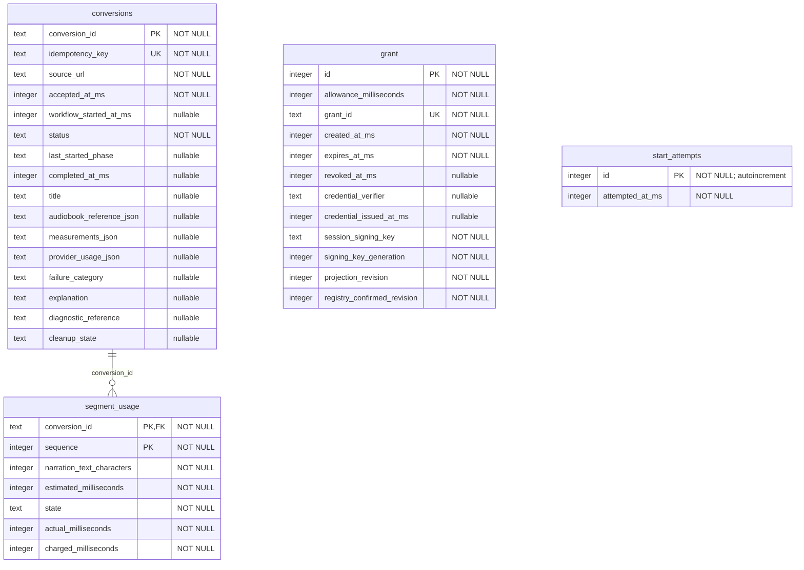
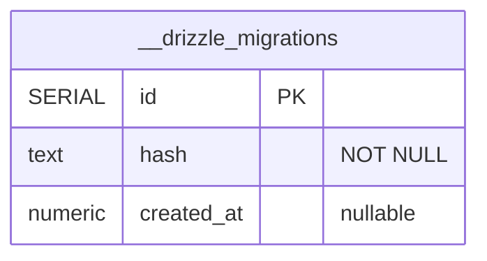

# Durable Object database schemas

These diagrams describe all three application SQLite stores in the current checkout. Each Durable Object instance has its own database; identifiers shared between stores do not establish cross-database foreign keys. See [storage ownership](README.md#storage-ownership) for how the objects cooperate.

The diagrams use physical SQL table and column names, storage types, and nullability. `PK` marks a primary key (multiple marked columns form one composite key), `FK` marks a declared foreign key, and `UK` marks an unconditional unique constraint on one column. Relationship lines show declared foreign keys only. Additional indexes are listed beneath each diagram; defaults and check constraints remain authoritative in the linked schemas and generated migrations. JSON columns appear as `text`, matching SQLite storage.

When a schema changes, update its diagram alongside the generated migration. The migration tests in each owning library verify that the current Drizzle schema and checked-in snapshot agree.

## Account object

`AccountDurableObject`. Each account has an isolated database for identity and lifecycle state, conversion history, listening positions, dispatch, duration accounting, artifact writers, and deletion confirmation. The account owns the rows through its Durable Object identity; most tables therefore have no foreign key to the singleton account row.

`account_playback_positions` stores one listening position per conversion in the listener's account object. It has no foreign key to `account_conversions` because signed-in listeners can save listening positions for unlisted trial articles that they do not own. See [position restoration and saves](conversion.md#delivery-positions-and-lifecycle) for player behavior.

Writers may target pending or ready conversions; account lifecycle and execution epochs fence their storage effects.

Sources: [account-sqlite-schema.ts](../../libs/accounts/src/account-sqlite-schema.ts), [sqlite-schema-shared.ts](../../libs/accounts/src/sqlite-schema-shared.ts); [migrations](../../libs/accounts/drizzle/account/).

```mermaid
erDiagram
    account_playback_positions {
        text conversion_id PK "NOT NULL; own or unlisted conversion"
        text synchronization_unit_id "NOT NULL"
        integer offset_milliseconds "NOT NULL; >= 0"
    }
    account_audio_segments {
        text conversion_id PK, FK "NOT NULL"
        integer sequence PK "NOT NULL"
        integer narration_characters "NOT NULL"
        integer estimated_ms "NOT NULL"
        text state "NOT NULL"
        integer actual_ms "NOT NULL"
        integer charged_ms "NOT NULL"
        text operation_id FK, UK "NOT NULL"
    }
    account_conversions {
        text conversion_id PK "NOT NULL"
        text idempotency_key UK "NOT NULL"
        text source_url "NOT NULL"
        text request_fingerprint "NOT NULL"
        integer created_at_ms "NOT NULL"
        text status "NOT NULL"
        text outcome_json "nullable"
        integer completed_at_ms "nullable"
    }
    account_tombstone {
        integer id PK "NOT NULL"
        text attempt_id "NOT NULL"
    }
    account {
        integer id PK "NOT NULL"
        text account_id UK "NOT NULL"
        text subject UK "NOT NULL"
        integer created_at_ms "NOT NULL"
        text state "NOT NULL"
        integer execution_epoch "NOT NULL"
        integer recovery_deadline_ms "nullable"
    }
    artifact_writers {
        text writer_id PK "NOT NULL"
        integer execution_epoch "NOT NULL"
        text prefix "NOT NULL"
        text state "NOT NULL"
        text unresolved_effect "nullable"
    }
    credit_balances {
        text unit PK "NOT NULL"
        integer available "NOT NULL"
        integer reserved "NOT NULL"
    }
    credit_ledger {
        text event_id PK "NOT NULL"
        text operation_id FK "NOT NULL"
        text event_kind "NOT NULL"
        text unit "NOT NULL"
        integer amount "NOT NULL"
        integer available_delta "NOT NULL"
        integer reserved_delta "NOT NULL"
        integer created_at_ms "NOT NULL"
        text cause "NOT NULL"
    }
    credit_operations {
        text operation_id PK "NOT NULL"
        text request_id UK "NOT NULL"
        text kind "NOT NULL"
        text unit "NOT NULL"
        integer amount "NOT NULL"
        text state "NOT NULL"
        text cause "NOT NULL"
    }
    deletion_attempts {
        text attempt_id PK "NOT NULL"
        text payload_json "NOT NULL"
        text state "NOT NULL"
        integer delivered "NOT NULL"
    }
    deletion_challenges {
        text challenge_id PK "NOT NULL"
        integer execution_epoch "NOT NULL"
        text state "NOT NULL"
        integer issued_at_ms "NOT NULL"
        integer expires_at_ms "NOT NULL"
        integer used "NOT NULL"
    }
    pending_jobs {
        text job_id PK "NOT NULL"
        text conversion_id FK, UK "NOT NULL"
        integer execution_epoch "NOT NULL"
        text state "NOT NULL"
    }
    rate_events {
        text bucket "NOT NULL"
        text event_id PK "NOT NULL"
        integer created_at_ms "NOT NULL"
        integer expires_at_ms "NOT NULL"
    }
    account_conversions ||--o{ account_audio_segments : "conversion_id"
    credit_operations ||--o| account_audio_segments : "operation_id"
    credit_operations ||--o{ credit_ledger : "operation_id"
    account_conversions ||--o| pending_jobs : "conversion_id"
```

Additional indexes:

| Table           | Columns                      | Rule                                                                  |
| --------------- | ---------------------------- | --------------------------------------------------------------------- |
| `credit_ledger` | `operation_id`               | Unique where `"credit_ledger"."event_kind" IN ('consume', 'release')` |
| `credit_ledger` | `operation_id`, `event_kind` | Unique                                                                |
| `rate_events`   | `bucket`, `created_at_ms`    | Non-unique                                                            |

## Conversion grant object

`ConversionGrantDurableObject`. Each conversion grant has an isolated database for its allowance, credentials, session signing state, conversions, duration reservations and usage, and start-rate accounting. The singleton grant row owns conversions through the Durable Object identity rather than a grant_id foreign key in the conversions table.

Sources: [grant-sqlite-schema.ts](../../libs/conversion-grants/src/grant-sqlite-schema.ts); [migrations](../../libs/conversion-grants/drizzle/grant/).

## Registry

`RegistryDurableObject`. One preserved singleton database stores grant inventory, account identity mappings and coordination, ingress rate limits, and conversion ownership for accounts and trials. `conversion_owners` is the sole conversion ownership mapping and requires exactly the owner identifier appropriate to `owner_kind`; account identifiers refer to separate Durable Object databases. Subject and deletion-attempt identifiers are coordinated by application logic, including records that outlive erased accounts.

Sources: [registry-sqlite-schema.ts](../../libs/registry/src/registry-sqlite-schema.ts), [rate-limit-schema.ts](../../libs/registry/src/rate-limit-schema.ts); [migrations](../../libs/registry/drizzle/registry/).

```mermaid
erDiagram
    canceled_deletion_attempts {
        text attempt_id PK "NOT NULL"
        integer expires_at_ms "NOT NULL"
    }
    deletion_jobs {
        text attempt_id PK "NOT NULL"
        text payload_json "NOT NULL"
    }
    deletion_notifications {
        text notification_key PK "NOT NULL"
        text attempt_id "NOT NULL"
        text payload_json "NOT NULL"
    }
    deletion_receipts {
        text attempt_id PK "NOT NULL"
        integer completed_at_ms "NOT NULL"
        integer expires_at_ms "NOT NULL"
        text result_json "NOT NULL"
    }
    identity_accounts {
        text subject PK "NOT NULL"
        text account_id UK "NOT NULL"
        integer created_at_ms "NOT NULL"
        text phase "NOT NULL"
    }
    provisioning_jobs {
        text subject PK "NOT NULL"
        integer attempts "NOT NULL"
        integer next_attempt_ms "NOT NULL"
    }
    rate_events {
        text bucket "NOT NULL"
        text event_id PK "NOT NULL"
        integer created_at_ms "NOT NULL"
        integer expires_at_ms "NOT NULL"
    }
    conversion_owners {
        text conversion_id PK "NOT NULL"
        text owner_kind "NOT NULL"
        text grant_id "nullable"
        text account_id "nullable"
    }
    registry_grants {
        text grant_id PK "NOT NULL"
        text request_id UK "NOT NULL"
        text label "NOT NULL"
        text phase "NOT NULL"
        integer created_at_ms "NOT NULL"
        integer expires_at_ms "NOT NULL"
        integer credential_issued "NOT NULL"
        integer projection_allowance_milliseconds "NOT NULL"
        integer projection_revision "nullable"
        integer projection_revoked_at_ms "nullable"
        integer projection_reserved "nullable"
        integer projection_spent "nullable"
        integer projection_schema_version "nullable"
    }
```

Additional index: `rate_events_bucket` on `(bucket, created_at_ms)`.

## Migration metadata

Every store also has Drizzle’s internal `__drizzle_migrations` table, created by the Durable SQLite migrator rather than the application schema. It tracks applied migration timestamps and hashes independently in each database. The linked [account migration entry points](../../libs/accounts/src/sqlite-migrations.ts), [grant migration entry point](../../libs/conversion-grants/src/legacy-grant-migrations.ts) and [registry migration entry point](../../libs/registry/src/sqlite-migrations.ts) invoke that migrator. The diagram preserves its declared SQL types; `SERIAL PRIMARY KEY` is the migrator’s SQLite declaration, rather than an application autoincrement column.

